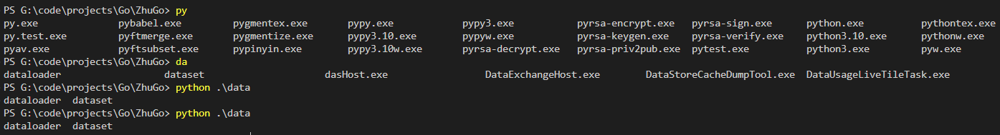

# BASH-STYLE TAB COMPLETION IN POWERSHELL

---

## Demo



## Features

- Bash-style completion that expands to the longest common prefix of candidate options. If no further completion is possible, it displays the candidate options.

- Automatically adds `.\` prefix where appropriate (except at the start of a command) to ensure only files in the working directory are completed, avoiding interference from PowerShell built-in commands or environment variables.

## Usage

```pwsh
./install.ps1 # Run as administrator if the script fails
```

Then restart PowerShell.

## Technical Details

The tool ensures only files in the current working directory are completed by automatically prepending `.\`. Currently, it recognizes and skips adding `.\` in these cases:

1. Paths starting with `./`, `../`, `.\`, `..\`, `/`, `\`, `//`, `\\`, or a drive letter (e.g., `C:`).
1. Paths enclosed in quotes.

`install.ps1` writes `profile.ps1` to `$PROFILE`. If `$PROFILE` doesn't exist, the script creates it first. `$PROFILE` is PowerShell's configuration file and executes automatically on startup.
